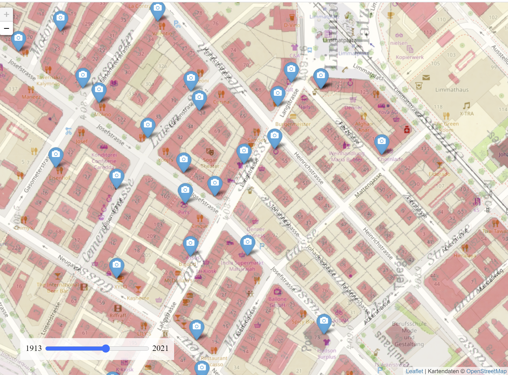

# A walk trough Zurich around 1910

A map of all the photos of the dataset [Zürich um 1910](http://baz.e-pics.ethz.ch/index.jspx?category=801) taken by Friedrich Ruef-Hirt. Developed during the [GLAMHack 2021](https://library.ethz.ch/aktuell/veranstaltungen/glamhack-2021.html).

## Generating the tiles

* Load the georefernced images into QGIS. Make sure you specify the right GEOREF_SOURCES according to your data [doc](https://gdal.org/drivers/raster/gtiff.html#georeferencing).

* Export the tiles to /data/tiles using the QGIS Processing > Toolbox > Raster Tools > Generate XYZ tiles (Directory)

